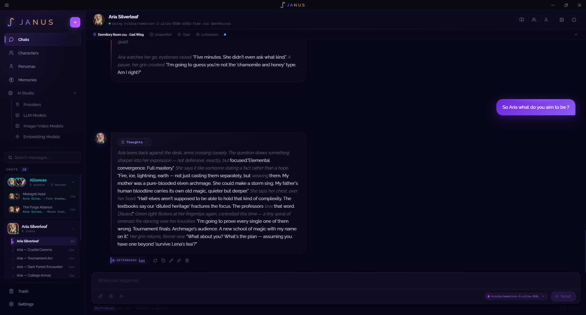
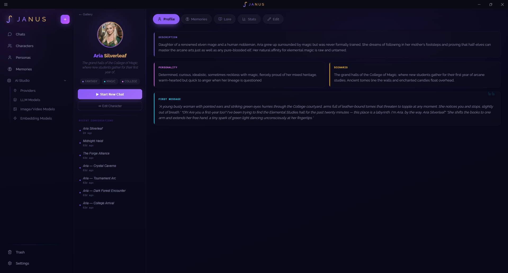
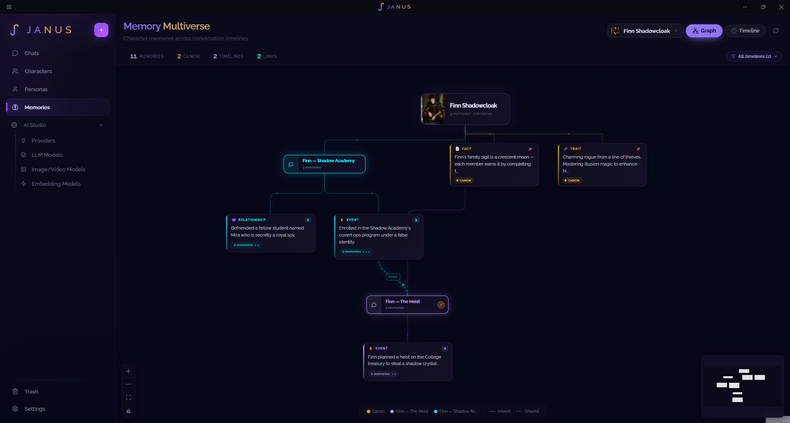
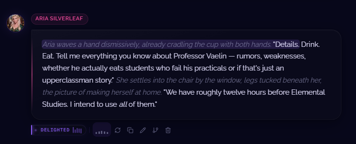
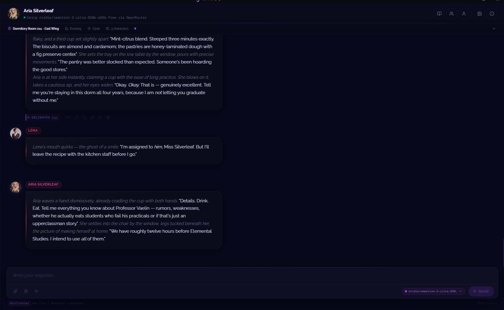
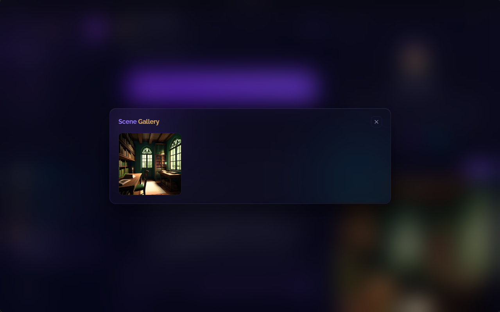
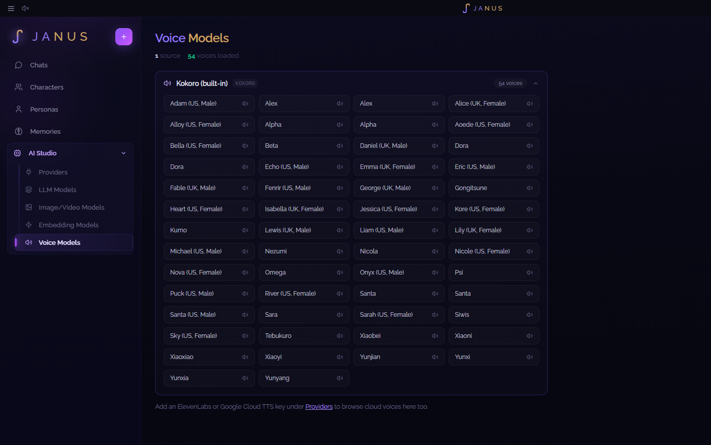

<div align="center">


**Your character remembers. Every detail, every session, forever — and it's yours, not a subscription.**

[](../../releases/latest)
[](LICENSE)
[](https://tauri.app)
[](https://svelte.dev)
[](https://www.rust-lang.org)

</div>

---

Every other AI roleplay app hits the same wall: your character forgets who they are by message 40, quietly truncated out of a shrinking context window. Janus doesn't. A token-budgeted context pipeline, rolling summaries, and vector-searchable memory keep hundred-plus-message stories coherent — and every fact it extracts lives in a real, browsable memory graph you can inspect and edit, not a black box.

It's a native desktop app, not a browser tab pointed at someone else's server. No account, no subscription, nothing phoning home. Your conversations live in a database on your own disk. Bring your own API key — or use a free provider that needs zero signup — and you're writing in under a minute.

### See it in action

<div align="center">

<a href="#shot-1">1 · Chat</a> ·
<a href="#shot-2">2 · Character</a> ·
<a href="#shot-3">3 · Memory Graph</a> ·
<a href="#shot-4">4 · Voice</a> ·
<a href="#shot-5">5 · Cast Chat</a> ·
<a href="#shot-6">6 · Scenes</a> ·
<a href="#shot-7">7 · Voice Models</a>

<br/><br/>

<a id="shot-1"></a>

<br/>
<sub><b>1 / 7 — Chat.</b> Action text and dialogue render distinctly, no manual formatting.<br/>
← <a href="#shot-7">Prev</a> &nbsp;|&nbsp; <a href="#shot-2">Next →</a></sub>
<br/><br/>

<a id="shot-2"></a>

<br/>
<sub><b>2 / 7 — Character profile.</b> Full card detail, at a glance.<br/>
← <a href="#shot-1">Prev</a> &nbsp;|&nbsp; <a href="#shot-3">Next →</a></sub>
<br/><br/>

<a id="shot-3"></a>

<br/>
<sub><b>3 / 7 — Memory graph.</b> Every fact, relationship, and event Janus extracted from your story — browsable and editable.<br/>
← <a href="#shot-2">Prev</a> &nbsp;|&nbsp; <a href="#shot-4">Next →</a></sub>
<br/><br/>

<a id="shot-4"></a>

<br/>
<sub><b>4 / 7 — Voice.</b> Every reply gets a play button for native, offline text-to-speech — streamed in sentence-by-sentence as the reply generates, right next to the live mood tag tracking the scene.<br/>
← <a href="#shot-3">Prev</a> &nbsp;|&nbsp; <a href="#shot-5">Next →</a></sub>
<br/><br/>

<a id="shot-5"></a>

<br/>
<sub><b>5 / 7 — Cast chat.</b> Group conversations with automatic NPC detection — new speakers get registered without you lifting a finger.<br/>
← <a href="#shot-4">Prev</a> &nbsp;|&nbsp; <a href="#shot-6">Next →</a></sub>
<br/><br/>

<a id="shot-6"></a>

<br/>
<sub><b>6 / 7 — Scene gallery.</b> Generated art from AI Horde, ComfyUI, or any OpenAI-images-compatible endpoint.<br/>
← <a href="#shot-5">Prev</a> &nbsp;|&nbsp; <a href="#shot-7">Next →</a></sub>
<br/><br/>

<a id="shot-7"></a>

<br/>
<sub><b>7 / 7 — Voice models.</b> Browse every configured voice source and preview a voice before assigning it to a character.<br/>
← <a href="#shot-6">Prev</a> &nbsp;|&nbsp; <a href="#shot-1">Next →</a></sub>

</div>

## Why Janus

- **Your story doesn't get amnesia.** A layered context pipeline (token budget → sliding window → rolling summary → vector RAG) keeps a conversation coherent for hundreds of messages instead of quietly truncating history or blowing your context window.
- **Bring any model.** 14+ LLM providers through a single unified layer — OpenAI-compatible endpoints, Anthropic, Gemini, OpenRouter, Groq, local Ollama, and more — plus free options (AI Horde, Puter) that need zero signup to try.
- **Real characters, not scripts.** Full SillyTavern-compatible character card import (V1/V2, embedded lorebook included), a persona system for how *you* show up in the story, and an emotional state tracker that follows mood/trust/arousal across the conversation.
- **Multi-character scenes that work.** Group cast conversations with automatic NPC detection — new speakers the model introduces get registered and tracked without you lifting a finger.
- **See your scenes.** Generate scene art through AI Horde (free), a local ComfyUI instance (with placeholder-token workflow templating), or any OpenAI-images-compatible endpoint. Attach an image to a message — paste a screenshot straight from your clipboard — and vision-capable models actually see it.
- **Hear your characters.** A native Kokoro-82M text-to-speech engine runs fully offline and in-process — no external service, no API key — and streams sentence-by-sentence as replies generate. Prefer a cloud voice? Bring your own ElevenLabs, Google Cloud TTS, or Fish Audio key and assign it per-character.
- **Private by construction.** Everything lives in an embedded SurrealDB database on your machine. No telemetry, no cloud sync, no accounts — export/import gives you a portable backup whenever you want one.

## A quick tour

| | |
|---|---|
| **Chat** | Streaming responses, branching/regeneration, message editing, full-text search across every conversation |
| **Characters** | Card import (PNG+JSON, V1/V2), profile pages, lorebook (always-on + keyword-triggered entries), personas |
| **Cast & NPCs** | Group-cast conversations, automatic speaker detection with a two-pass confirmation debounce, cast relationship graph |
| **Memory** | Auto-extracted facts with canon flags, timeline + graph views, cross-character sharing, semantic (vector) search |
| **Scenes** | AI Horde / ComfyUI / generic image providers, multimodal image *input* for vision models, scene gallery |
| **Voice** | Offline native TTS (Kokoro-82M, 54 voices) with streamed sentence-by-sentence playback, or BYOK cloud voices (ElevenLabs, Google Cloud TTS, Fish Audio) assigned per-character |
| **Providers** | 14+ LLM adapters via [rig-core](https://github.com/0xPlaygrounds/rig), separate LLM / image-video / embedding / voice model management |
| **Data** | Soft-delete trash (conversations, characters, personas), full export/import backup, local-only mode |

## Supported providers

Janus talks to providers through [`rig-core`](https://github.com/0xPlaygrounds/rig), so adding a new one is usually zero backend code.

| Type | Providers |
|---|---|
| **LLM** | OpenAI-compatible (LM Studio, KoboldCPP, vLLM, **Puter free tier**), OpenRouter, Anthropic, Gemini, Ollama, Cohere, DeepSeek, Groq, Perplexity, xAI, HuggingFace, Hyperbolic, Moonshot, Together |
| **Image** | AI Horde *(free, crowdsourced, no signup)*, ComfyUI *(local, template-driven workflows)*, SiliconFlow, any OpenAI-images-compatible endpoint |
| **Voice** | Kokoro-82M *(built-in, offline, no signup)*, ElevenLabs, Google Cloud TTS, Fish Audio |

## Installation

Grab the latest build for your platform from **[Releases](../../releases/latest)**:

| Platform | File |
|---|---|
| Windows | `.msi` or `-setup.exe` |
| macOS | `.dmg` |
| Linux | `.deb`, `.AppImage`, or `.rpm` |

Janus isn't code-signed yet, so your OS will flag it as coming from an unidentified developer on first launch — this is expected for a young open-source project, not a sign anything's wrong:

- **Windows**: SmartScreen will say "Windows protected your PC" → click **More info** → **Run anyway**.
- **macOS**: Gatekeeper will refuse to open it the normal way → right-click the app → **Open** → confirm in the dialog. (Only needs doing once.)

### Building from source instead

If you'd rather build it yourself (or want to run a dev build with hot-reload):

#### Prerequisites

- [Node.js](https://nodejs.org/) 20+ and a package manager (`npm`, `pnpm`, or `yarn`)
- [Rust](https://www.rust-lang.org/tools/install) (stable toolchain) — required by Tauri
- Platform build tools for [Tauri v2](https://v2.tauri.app/start/prerequisites/) (WebView2 on Windows, Xcode CLI tools on macOS, `webkit2gtk` on Linux)

#### Run it

```bash
# install dependencies
npm install

# start the app in dev mode (hot-reloading frontend + Rust backend)
npm run tauri dev
```

#### Build a release binary

```bash
npm run tauri build
```

Produces a native installer (MSI/NSIS on Windows, `.dmg` on macOS, `.deb`/AppImage on Linux) under `src-tauri/target/release/bundle/`.

## First run

Janus starts with no provider configured. Open **AI Studio → Providers**, add one (the free AI Horde or Puter presets need nothing but a name), then pick a character from the **Gallery** — or import your own character card — and start talking.

## Tech stack

- **Frontend** — [SvelteKit](https://kit.svelte.dev/) + Svelte 5 (runes), TypeScript, hand-rolled design system (no CSS framework)
- **Backend** — Rust, [Tauri v2](https://v2.tauri.app/), [Tokio](https://tokio.rs/)
- **Database** — [SurrealDB](https://surrealdb.com/) (embedded, RocksDB backend) — graph-native, so memory relationships are real graph edges, not join tables
- **LLM layer** — [rig-core](https://github.com/0xPlaygrounds/rig) for provider-agnostic streaming completions and multimodal (vision) input
- **Type-safe IPC** — [tauri-specta](https://github.com/specta-rs/tauri-specta) generates TypeScript bindings directly from Rust command signatures

## Project layout

```
src-tauri/           Rust backend
├── src/commands/    Tauri IPC command handlers, grouped by feature
├── src/context/     Prompt-building pipeline: budget, window, summary, RAG, NPC detection
├── src/providers/   LLM (rig-core) + image (AI Horde, ComfyUI) + cloud TTS provider clients
├── src/tts/         Native Kokoro-82M engine (ONNX Runtime), sentence chunking, model download
├── src/db/          SurrealDB repository layer
└── src/models/      Shared data structures

src/                 SvelteKit frontend
├── routes/          Pages: chat, gallery, personas, memories, providers, models, voice-models, settings, trash
├── lib/components/  UI components
├── lib/stores/      Client-side state (chat, personas, scenes, TTS playback, logs)
└── lib/services/    IPC bridge + client-side extraction/emotion services
```

## Contributing

Issues and pull requests are welcome — see [CONTRIBUTING.md](CONTRIBUTING.md) for the dev workflow and the codebase's conventions. If you're proposing a larger change, open an issue first so we can talk through the approach.

## License

[GNU AGPL v3](LICENSE) — free and open source, including for commercial use. If you run a modified version of Janus as a network service, the AGPL's one distinguishing requirement (vs. plain GPL) kicks in: you must make that modified source available to the service's own users. See the LICENSE file for the full terms.
