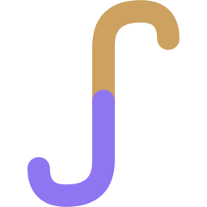
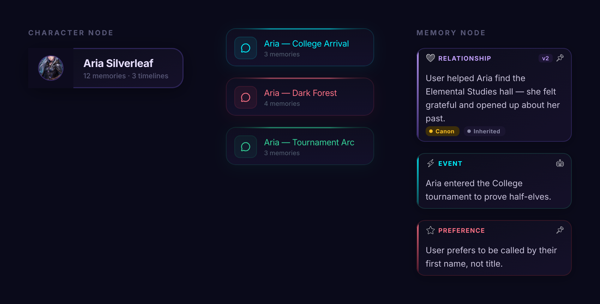

<div align="center">



# Janus

**A local-first AI roleplay chat app that actually remembers your story.**

[](LICENSE)
[](https://tauri.app)
[](https://svelte.dev)
[](https://www.rust-lang.org)
[](https://surrealdb.com)

</div>

---

Janus is a desktop roleplay chat client for people who are tired of their character forgetting who they are by message 40. It pairs a token-budgeted context pipeline, rolling summaries, and vector-searchable memory with a native Tauri app — so long-running stories stay coherent, your data stays on your own disk, and you're never locked into one AI provider.

No account. No server. No subscription. Bring your own API key (or use a free one) and start writing.

<div align="center">

<br/>
<sub>The memory graph — every fact, relationship, and event Janus has extracted from your story, browsable and editable.</sub>
</div>

## Why Janus

- **Your story doesn't get amnesia.** A layered context pipeline (token budget → sliding window → rolling summary → vector RAG) keeps a conversation coherent for hundreds of messages instead of quietly truncating history or blowing your context window.
- **Bring any model.** 14+ LLM providers through a single unified layer — OpenAI-compatible endpoints, Anthropic, Gemini, OpenRouter, Groq, local Ollama, and more — plus free options (AI Horde, Puter) that need zero signup to try.
- **Real characters, not scripts.** Full SillyTavern-compatible character card import (V1/V2, embedded lorebook included), a persona system for how *you* show up in the story, and an emotional state tracker that follows mood/trust/arousal across the conversation.
- **Multi-character scenes that work.** Group cast conversations with automatic NPC detection — new speakers the model introduces get registered and tracked without you lifting a finger.
- **See your scenes.** Generate scene art through AI Horde (free), a local ComfyUI instance (with placeholder-token workflow templating), or any OpenAI-images-compatible endpoint. Attach an image to a message — paste a screenshot straight from your clipboard — and vision-capable models actually see it.
- **Private by construction.** Everything lives in an embedded SurrealDB database on your machine. No telemetry, no cloud sync, no accounts — export/import gives you a portable backup whenever you want one.

## A quick tour

| | |
|---|---|
| **Chat** | Streaming responses, branching/regeneration, message editing, full-text search across every conversation |
| **Characters** | Card import (PNG+JSON, V1/V2), profile pages, lorebook (always-on + keyword-triggered entries), personas |
| **Cast & NPCs** | Group-cast conversations, automatic speaker detection with a two-pass confirmation debounce, cast relationship graph |
| **Memory** | Auto-extracted facts with canon flags, timeline + graph views, cross-character sharing, semantic (vector) search |
| **Scenes** | AI Horde / ComfyUI / generic image providers, multimodal image *input* for vision models, scene gallery |
| **Providers** | 14+ LLM adapters via [rig-core](https://github.com/0xPlaygrounds/rig), separate LLM / image-video / embedding model management |
| **Data** | Soft-delete trash (conversations, characters, personas), full export/import backup, local-only mode |

## Supported providers

Janus talks to providers through [`rig-core`](https://github.com/0xPlaygrounds/rig), so adding a new one is usually zero backend code.

| Type | Providers |
|---|---|
| **LLM** | OpenAI-compatible (LM Studio, KoboldCPP, vLLM, **Puter free tier**), OpenRouter, Anthropic, Gemini, Ollama, Cohere, DeepSeek, Groq, Perplexity, xAI, HuggingFace, Hyperbolic, Moonshot, Together |
| **Image** | AI Horde *(free, crowdsourced, no signup)*, ComfyUI *(local, template-driven workflows)*, SiliconFlow, any OpenAI-images-compatible endpoint |

## Getting started

### Prerequisites

- [Node.js](https://nodejs.org/) 20+ and a package manager (`npm`, `pnpm`, or `yarn`)
- [Rust](https://www.rust-lang.org/tools/install) (stable toolchain) — required by Tauri
- Platform build tools for [Tauri v2](https://v2.tauri.app/start/prerequisites/) (WebView2 on Windows, Xcode CLI tools on macOS, `webkit2gtk` on Linux)

### Run it

```bash
# install dependencies
npm install

# start the app in dev mode (hot-reloading frontend + Rust backend)
npm run tauri dev
```

### Build a release binary

```bash
npm run tauri build
```

Produces a native installer (MSI/NSIS on Windows, `.dmg` on macOS, `.deb`/AppImage on Linux) under `src-tauri/target/release/bundle/`.

### First run

Janus starts with no provider configured. Open **AI Studio → Providers**, add one (the free AI Horde or Puter presets need nothing but a name), then pick a character from the **Gallery** — or import your own character card — and start talking.

## Tech stack

- **Frontend** — [SvelteKit](https://kit.svelte.dev/) + Svelte 5 (runes), TypeScript, hand-rolled design system (no CSS framework)
- **Backend** — Rust, [Tauri v2](https://v2.tauri.app/), [Tokio](https://tokio.rs/)
- **Database** — [SurrealDB](https://surrealdb.com/) (embedded, RocksDB backend) — graph-native, so memory relationships are real graph edges, not join tables
- **LLM layer** — [rig-core](https://github.com/0xPlaygrounds/rig) for provider-agnostic streaming completions and multimodal (vision) input
- **Type-safe IPC** — [tauri-specta](https://github.com/specta-rs/tauri-specta) generates TypeScript bindings directly from Rust command signatures

## Project layout

```
src-tauri/           Rust backend
├── src/commands/    Tauri IPC command handlers, grouped by feature
├── src/context/     Prompt-building pipeline: budget, window, summary, RAG, NPC detection
├── src/providers/   LLM (rig-core) + image (AI Horde, ComfyUI) provider clients
├── src/db/          SurrealDB repository layer
└── src/models/      Shared data structures

src/                 SvelteKit frontend
├── routes/          Pages: chat, gallery, personas, memories, providers, models, settings, trash
├── lib/components/  UI components
├── lib/stores/      Client-side state (chat, personas, scenes, logs)
└── lib/services/    IPC bridge + client-side extraction/emotion services
```

## Contributing

Issues and pull requests are welcome — see [CONTRIBUTING.md](CONTRIBUTING.md) for the dev workflow and the codebase's conventions. If you're proposing a larger change, open an issue first so we can talk through the approach.

## License

[GNU AGPL v3](LICENSE) — free and open source, including for commercial use. If you run a modified version of Janus as a network service, the AGPL's one distinguishing requirement (vs. plain GPL) kicks in: you must make that modified source available to the service's own users. See the LICENSE file for the full terms.
